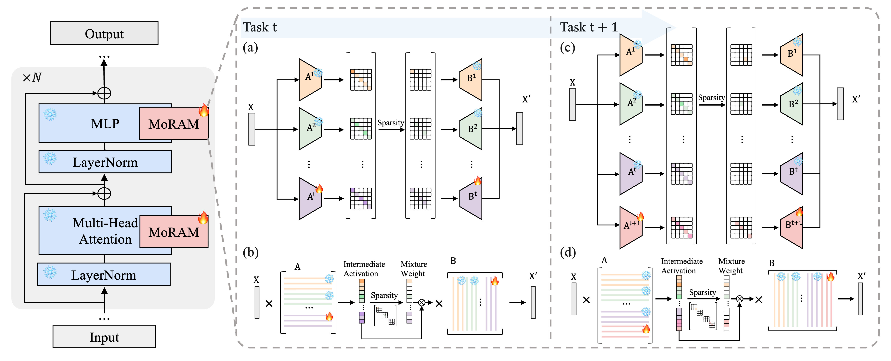

<table align="center"><tr>
  <td></td>
  <td><h1>MoRAM &mdash; Little By Little</h1></td>
</tr></table>

<p align="center"><b>Continual Learning via Incremental Mixture of Rank-1 Associative Memory Experts</b></p>

<p align="center">
  <a href="https://jeff024.github.io/projects/moram/"></a>
  <a href="https://openreview.net/forum?id=P247k4ELcn"></a>
  <a href="https://arxiv.org/abs/2506.21035"></a>
  <a href="LICENSE"></a>
</p>

<p align="center">
  <a href="https://jeff024.github.io/">Haodong Lu</a>, Chongyang Zhao, Minhui Xue, Lina Yao, Kristen Moore, <a href="https://donggong1.github.io/">Dong Gong</a>
</p>

<p align="center">
  
</p>

> Official implementation of **Little By Little: Continual Learning via Incremental Mixture of Rank-1 Associative Memory Experts** (ICML 2026).

---

## Abstract

Existing LoRA-based Mixture-of-Experts methods for continual learning mitigate forgetting by adding new task-specific adapters and freezing old ones, but often suffer from redundancy, interference, and ambiguous routing. We propose **MoRAM**, which treats weight matrices as **linear associative memories** and decomposes updates into atomic **rank-1 experts**. Rather than relying on explicit routers, MoRAM employs a **self-activation mechanism** where each memory atom evaluates its own relevance via its intrinsic key, enabling content-addressable retrieval. Experiments on CLIP and large language models demonstrate that MoRAM significantly outperforms state-of-the-art baselines, achieving superior plasticity-stability trade-offs while preserving generalization.

## Overview of Methodology

<p align="center">
  
</p>
<p align="center"><em>Conventional MoE-LoRA (top) adds an indivisible rank-<i>r</i> expert per task; MoRAM (bottom) appends atomic rank-1 key&ndash;value memories with router-free self-activation.</em></p>

<p align="center">
  
</p>

MoRAM reconceptualizes parameter-efficient continual learning as **incremental associative memory expansion**:

1. **Rank-1 Associative Memory Experts** — Each weight update ΔW is decomposed into atomic rank-1 key-value pairs (*k*ᵢ, *v*ᵢ). The key determines relevance to an input; the value stores the corresponding knowledge. This fine-grained decomposition enables precise knowledge reuse with minimal cross-task interference.

2. **Self-Activation (Content-Addressable Routing)** — Mixing weights are derived directly from the intrinsic alignment between each memory key and the input, eliminating the need for auxiliary router networks. An L₂-normalized relevance score determines each atom's contribution.

3. **Sparse Expert Selection** — Top-*k* masking, temperature scaling (τ), and a relevance threshold (δ) work in concert to sharpen the mixture distribution, concentrating activation on specialist atoms and suppressing noise.

4. **Incremental Learning** — For each new task, *r* new rank-1 atoms are introduced while all prior atoms are frozen. The self-activation mechanism jointly routes across the union of old and new memories, enabling forward transfer without forgetting.

## Benchmarks

This repository provides two benchmark evaluations:

| Benchmark | Domain | Backbone | Directory |
|:----------|:-------|:---------|:----------|
| **X-TAIL** | Vision-language | CLIP (ViT-B-16) | [`XTAIL/`](XTAIL/) |
| **TRACE** | Language | LLMs (LLaMA, Gemma, etc.) | [`TRACE/`](TRACE/) |

See each benchmark's README for detailed setup and running instructions:

- [**XTAIL README**](XTAIL/README.md) — CLIP continual learning 
- [**TRACE README**](TRACE/README.md) — LLM continual learning 

## Results

### CLIP Continual Learning (X-TAIL, 10 Domains)

| Method | Transfer | Average | Last |
|:---|:---:|:---:|:---:|
| MoE-Adapter | 56.0 | 63.0 | 70.5 |
| RAIL-Primal | 62.4 | 70.7 | 79.1 |
| CoDyRA | 63.2 | 71.3 | 79.2 |
| **MoRAM (Ours)** | **63.3** | **72.7** | **80.9** |

### LLM Continual Learning (TRACE Benchmark)

| Model | Method | Overall Perf. ↑ | Backward Transfer ↓ |
|:---|:---|:---:|:---:|
| LLaMA-2-7B-Chat | O-LoRA | 42.78 | 7.16 |
| | TreeLoRA | 43.52 | 3.46 |
| | **MoRAM (Ours)** | **44.54** | **1.37** |
| Gemma-2B-it | O-LoRA | 33.73 | 12.36 |
| | TreeLoRA | 33.41 | 8.50 |
| | **MoRAM (Ours)** | **36.27** | **2.74** |
| LLaMA-3-1B-Instruct | O-LoRA | 32.94 | 12.89 |
| | TreeLoRA | 36.14 | 7.36 |
| | **MoRAM (Ours)** | **37.77** | **3.12** |

## License

MoRAM is released under the Apache License 2.0. See [`LICENSE`](LICENSE) for details.

## Citation

```bibtex
@inproceedings{lu2026little,
  title     = {Little By Little: Continual Learning via Incremental Mixture of Rank-1 Associative Memory Experts},
  author    = {Lu, Haodong and Zhao, Chongyang and Xue, Minhui and Yao, Lina and Moore, Kristen and Gong, Dong},
  booktitle = {Forty-third International Conference on Machine Learning},
  year      = {2026},
  url       = {https://openreview.net/forum?id=P247k4ELcn}
}
```

## Acknowledgement

Our repo benefits from [MoE-Adapters](https://github.com/JiazuoYu/MoE-Adapters4CL), [RAIL](https://github.com/linghan1997/Regression-based-Analytic-Incremental-Learning), [CoDyRA](https://github.com/jeff024/codyra), and [TreeLoRA](https://github.com/QianYuanYZ/TreeLoRA). We thank them for their wonderful works.
